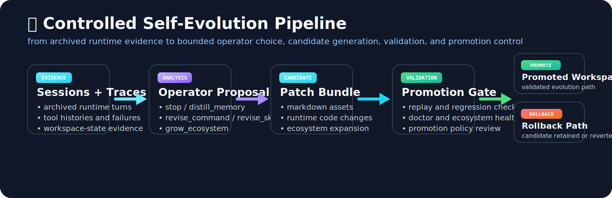
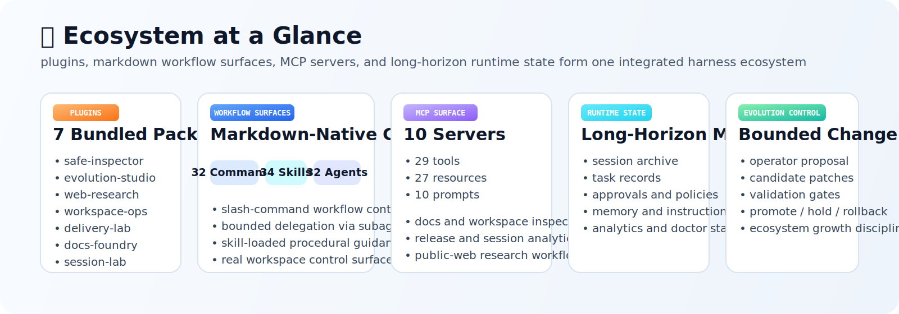

<table align="center">
  <tr>
    <td align="center" valign="middle" width="180">
      
    </td>
    <td align="left" valign="middle">
      
    </td>
  </tr>
</table>

<p align="center">
  
</p>

<p align="center">
  <strong>English</strong> | <a href="./README.zh-CN.md">ZH-CN</a>
</p>

## 🧠 Controlled Self-Evolution (-_-)

<div align="center">
  
</div>

EvoHarness frames self-evolution as a **bounded systems loop** over the harness itself, not as an unconstrained autonomous behavior policy.

The central research claim is that long-horizon improvement becomes tractable when three constraints hold simultaneously:

1. **evidence is real**: evolution is grounded in archived sessions, tool trajectories, approvals, failures, and workspace state
2. **action space is bounded**: changes are proposed through explicit operator families such as `distill_memory`, `revise_command`, `revise_skill`, or `grow_ecosystem`
3. **promotion is governed**: candidate patches remain subject to validation, promotion policy, and rollback discipline

In EvoHarness, the evolution target is the harness surface itself:

- commands and skills
- agents and plugin bundles
- MCP registries and workflow ecosystems
- persistent memory and instruction layers
- promotion and safety policy surfaces

The operational loop is:

1. archive sessions, traces, tool histories, and failure evidence
2. analyze where the harness under-supported the task or over-explored the search space
3. choose a bounded operator family
4. materialize candidate patches against the real workspace
5. validate before promotion
6. promote, hold, or rollback

This design emphasizes:

- evidence-grounded evolution rather than speculative self-editing
- explicit operator semantics rather than free-form mutation
- candidate-first progression rather than immediate mutation of the active surface
- promotion and rollback discipline rather than irreversible drift
- workspace-native artifacts instead of hidden internal state

From a research standpoint, EvoHarness is useful because it exposes **where** improvement pressure comes from, **what** is allowed to change, and **how** those changes are promoted into the active runtime.

---

## 🧩 Harness Architecture \(^_^)/ 

<div align="center">
  
</div>

EvoHarness exposes the harness as a visible engineering surface, not a hidden runtime shell.

Core surface at a glance:

- 🛠️ **26 tools** for files, shell, search, tasks, registry, MCP, and subagents
- 🧾 **32 commands** for repeatable workflow entry points
- 🧠 **34 skills** for on-demand procedural guidance
- 🤖 **32 agents** for bounded delegation and inspection
- 🔌 **7 plugins** for workspace-native ecosystem growth
- 🛰️ **10 MCP servers / 29 MCP tools** for external tools, resources, and prompts

Architecturally, the runtime ties together:

- terminal-native control with slash commands and session state
- markdown workflow surfaces in `.claude/`
- plugin-native bundles in `plugins/`
- MCP-native tools, resources, and prompts
- long-horizon memory, analytics, approvals, and evolution planning

The design point is explicit: the harness itself is the system under study.

---

## 🚀 Quick Start \(^o^)/

### Requirements

- Python 3.11+
- Node.js 18+ if you want the React/Ink terminal frontend

### Fastest Source Launch

```bash
git clone https://github.com/HITSZ-DS/EvoHarness.git
cd EvoHarness
python -m evo_harness
```

If `npm` is available, frontend dependencies are installed automatically on the first TUI launch `(^_^)/`

### Optional Editable Install

If you want the shorter CLI alias:

```bash
python -m pip install -e .
evoh
```

### Useful First Commands

```bash
evoh doctor --workspace .
evoh tools-list --workspace .
evoh commands-list --workspace .
evoh agents-list --workspace .
evoh mcp-list --workspace . --kind all
```

### Inside the Session

```text
/help
/permissions
/resume
/plugins
/plugins marketplaces
/docs-refresh onboarding flow
/workflow-blueprint provider debugging
```

---

## 🕸️ Plugin and MCP Ecosystem (╭☞•́⍛•̀)╭☞

Bundled plugins:

- `safe-inspector`
- `evolution-studio`
- `web-research`
- `workspace-ops`
- `delivery-lab`
- `docs-foundry`
- `session-lab`

Bundled MCP surfaces cover:

- docs search and repair
- workspace surface inspection
- release-readiness review
- session and approval forensics
- public-web research
- plugin and workflow design

<div align="center">
  
</div>

Current runtime surface:

- **26 builtin tools**
- **32 commands**
- **34 skills**
- **32 agents**
- **7 plugins**
- **10 MCP servers**
- **29 MCP tools / 27 MCP resources / 10 MCP prompts**

---

## 📚 Documentation (•‿•)

- [Architecture](./docs/architecture.md)
- [Feature Matrix (zh-CN)](./docs/feature-matrix.zh-CN.md)
- [Project Positioning (zh-CN)](./docs/project-positioning.zh-CN.md)
- [Roadmap (zh-CN)](./docs/roadmap.zh-CN.md)
- [OpenHarness Reference](./docs/openharness-reference.md)

---

## 📝 Citation (._.)

If you want to cite EvoHarness as software:

```bibtex
@software{evoharness2026,
  title  = {EvoHarness: A Terminal-Native Agent Harness with Controlled Self-Evolution},
  author = {EvoHarness Contributors},
  year   = {2026},
  url    = {https://github.com/HITSZ-DS/EvoHarness}
}
```

A machine-readable citation file is also provided in [CITATION.cff](./CITATION.cff).

---

## 📄 License

Apache-2.0. See [LICENSE](./LICENSE).
