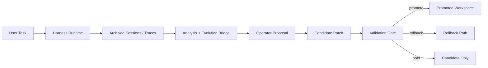

<div align="center">
  
</div>

<div align="center">

[](./pyproject.toml)
[](./src)
[](./src/evo_harness/harness/tools.py)
[](./.claude/commands)
[](./plugins)
[](./.evo-harness/mcp.json)
[](./LICENSE)

</div>

<div align="center">

**English | [ZH-CN](./README.zh-CN.md)**

</div>

**EvoHarness** is a terminal-native agent harness for coding workflows and controlled self-evolution research.  
It makes the harness itself explicit: tools, commands, skills, agents, plugins, MCP, memory, approvals, sessions, and evolution operators all stay visible, editable, and inspectable `(^_^)/`

One command, **`evoh`**, launches a runtime that is:

- markdown-first for commands, skills, and agents
- plugin-native for ecosystem growth
- MCP-ready for external tools, resources, and prompts
- serious about controlled self-evolution rather than vague "auto-improvement"

This GitHub release is intentionally trimmed for publication.  
It keeps the runtime, frontend, plugins, default ecosystem, and docs, while removing tests, examples, caches, and local noise `(._.)`

---

## Why EvoHarness `\(^o^)/`

<table>
  <tr>
    <td width="20%" valign="top">
      <strong>Terminal Runtime</strong><br><br>
      - interactive CLI / TUI<br>
      - slash-command workflow control<br>
      - tool execution, streaming, and approvals
    </td>
    <td width="20%" valign="top">
      <strong>Markdown Surfaces</strong><br><br>
      - 32 commands<br>
      - 34 skills<br>
      - 32 agents<br>
      - repo-native workflow packaging
    </td>
    <td width="20%" valign="top">
      <strong>Plugin + MCP</strong><br><br>
      - 7 bundled plugins<br>
      - 10 MCP servers<br>
      - tools / resources / prompts<br>
      - marketplace-ready layout
    </td>
    <td width="20%" valign="top">
      <strong>Governance</strong><br><br>
      - approvals and permission modes<br>
      - hooks and policy surfaces<br>
      - session archives and task control
    </td>
    <td width="20%" valign="top">
      <strong>Self-Evolution</strong><br><br>
      - trace-to-plan bridge<br>
      - revise command / skill / memory<br>
      - candidate, promote, rollback<br>
      - ecosystem growth operators
    </td>
  </tr>
</table>

---

## Quick Start `(^_^)/`

### Requirements

- Python 3.11+
- Node.js 18+ for the React/Ink terminal frontend

### Install

```bash
git clone https://github.com/HITSZ-DS/EvoHarness.git
cd EvoHarness
python -m pip install -e .
cd frontend/terminal && npm install
cd ../..
```

### Launch

```bash
evoh
```

### Useful First Commands

```bash
evoh doctor --workspace .
evoh tools-list --workspace .
evoh commands-list --workspace .
evoh agents-list --workspace .
evoh mcp-list --workspace . --kind all
```

### Inside the Session

```text
/help
/permissions
/resume
/plugins
/plugins marketplaces
/docs-refresh onboarding flow
/workflow-blueprint provider debugging
```

---

## Core Surfaces `(>_<)`

Current release surface:

- **26 builtin tools** for files, search, shell, JSON, tasks, registry inspection, MCP, and subagents
- **32 markdown commands** for repeatable terminal workflows
- **34 skills** for on-demand workflow guidance
- **32 agents** for bounded delegation and structured inspection
- **7 bundled plugins** for web research, workspace ops, delivery, docs, sessions, safety, and ecosystem growth
- **10 MCP servers** exposing **29 tools**, **27 resources**, and **10 prompts**

The repo ships the harness as a **real workspace**, not only as a library.  
That means `.claude/`, `plugins/`, and `.evo-harness/mcp.json` are part of the product surface `(._.)`

---

## Controlled Self-Evolution `(-_-)`

EvoHarness treats self-evolution as a **controlled systems problem** rather than an aesthetic slogan.

The main loop is:

1. archive real sessions and runtime traces
2. analyze where the harness stalled, over-explored, or under-supported the task
3. propose an operator such as:
   `stop`, `distill_memory`, `revise_command`, `revise_skill`, or `grow_ecosystem`
4. produce candidate changes
5. validate before promotion
6. promote, keep as candidate, or rollback



Research-wise, the emphasis is on:

- observable failure modes
- bounded operator choices
- workspace-native evolution artifacts
- promotion / rollback discipline

---

## Repository Layout `(^_^)`

```text
EvoHarness/
  src/evo_harness/         # core runtime, CLI, harness modules, evolution bridge
  frontend/terminal/       # React + Ink terminal frontend
  plugins/                 # bundled plugin ecosystem
  .claude/                 # default commands, skills, and agents
  .evo-harness/            # default MCP and marketplace registry
  docs/                    # architecture and project positioning docs
  scripts/                 # live / chat / self-evolution workbenches
  CLAUDE.md                # public project instruction surface
```

Trimmed from this GitHub-ready release:

- `tests/`
- `examples/`
- `node_modules/`
- runtime logs, caches, and generated local state

---

## Plugin and MCP Ecosystem `\(^o^)/`

Bundled plugins:

- `safe-inspector`
- `evolution-studio`
- `web-research`
- `workspace-ops`
- `delivery-lab`
- `docs-foundry`
- `session-lab`

Bundled local MCP servers:

- `workspace-docs`
- `workspace-intel`
- `quality-gate`
- `docs-gap`
- `session-lab`
- plus plugin-scoped MCP surfaces for the corresponding plugins

This gives the repo a practical default ecosystem for:

- docs search and repair
- workspace surface inspection
- release-readiness review
- session and approval forensics
- public-web research
- plugin and workflow design

---

## Visual Assets `(._.)`

The repository already includes one local banner for GitHub display.

For the next visual pass, see [docs/ASSET_PLAN.md](./docs/ASSET_PLAN.md).

That file lists:

- which screenshots are best provided by you
- which visuals are better generated or illustrated
- ready-to-use prompts for AI-generated assets

---

## Citation

If you want to cite EvoHarness as software:

```bibtex
@software{evoharness2026,
  title  = {EvoHarness: A Terminal-Native Agent Harness with Controlled Self-Evolution},
  author = {EvoHarness Contributors},
  year   = {2026},
  url    = {https://github.com/HITSZ-DS/EvoHarness}
}
```

A machine-readable citation file is also provided in [CITATION.cff](./CITATION.cff).

---

## License

Apache-2.0. See [LICENSE](./LICENSE).

