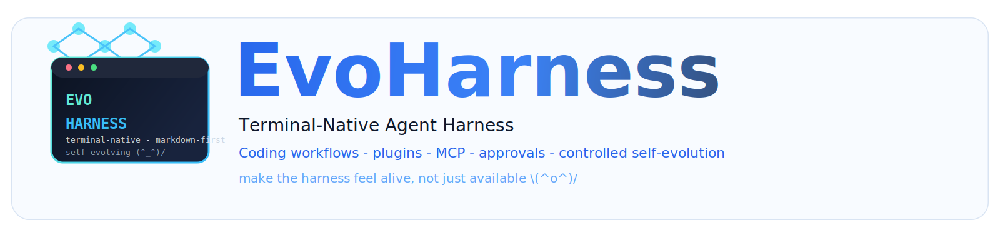
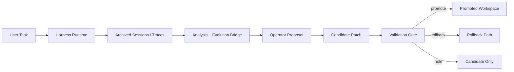

<div align="center">
  
</div>

<div align="center">

[](./pyproject.toml)
[](./src)
[](./src/evo_harness/harness/tools.py)
[](./.claude/commands)
[](./plugins)
[](./.evo-harness/mcp.json)
[](./LICENSE)

</div>

<div align="center">

[English](./README.md) | **简体中文**

</div>

**EvoHarness** 是一个面向 coding workflows 与可控自进化研究的 terminal-native agent harness。  
它把 harness 本身显式化了：tools、commands、skills、agents、plugins、MCP、memory、approvals、sessions 与 evolution operators 都是可见、可改、可检查的 `(^_^)/`

这个 GitHub 发布目录是精简公开版。  
它保留了 runtime、frontend、plugins、默认生态和 docs，同时移除了 tests、examples、cache 和本地生成文件 `(._.)`

---

## 核心定位 `\(^o^)/`

- terminal-native runtime，面向真实 coding session
- markdown-first workflow surfaces，用 `.claude/` 组织 commands / skills / agents
- plugin-native ecosystem，用 `plugins/` 扩展能力
- MCP-ready architecture，支持 tools / resources / prompts
- controlled self-evolution，强调 trace、operator、candidate、validation、promote / rollback

---

## 快速开始 `(^_^)/`

### 环境要求

- Python 3.11+
- Node.js 18+（React/Ink terminal frontend）

### 源码目录直接启动

```bash
git clone https://github.com/HITSZ-DS/EvoHarness.git
cd EvoHarness
python -m evo_harness
```

首次 TUI 启动时，如果本机有 `npm`，前端依赖会自动安装。

### 可选安装命令别名

```bash
evoh
```

### 建议先跑的命令

```bash
evoh doctor --workspace .
evoh tools-list --workspace .
evoh commands-list --workspace .
evoh agents-list --workspace .
evoh mcp-list --workspace . --kind all
```

---

## 当前 release surface `(>_<)`

- **26 builtin tools**
- **32 markdown commands**
- **34 skills**
- **32 agents**
- **7 bundled plugins**
- **10 MCP servers**
- MCP 侧合计 **29 tools / 27 resources / 10 prompts**

这个仓库把 harness 当成真实 workspace 来做，不只是一个 Python package。  
也就是说 `.claude/`、`plugins/`、`.evo-harness/mcp.json` 本身就是产品 surface 的一部分。

---

## 可控自进化 `(-_-)`

EvoHarness 对“自进化”的处理更偏 systems / runtime research，而不是口号式描述。

主要流程：

1. archive 真实 sessions 与 runtime traces
2. analyze harness 在哪里 stall、over-explore 或 ecosystem support 不足
3. propose operator，例如 `stop`、`distill_memory`、`revise_command`、`revise_skill`、`grow_ecosystem`
4. produce candidate changes
5. validate before promotion
6. promote、hold，或 rollback



---

## 仓库结构 `(^_^)`

```text
EvoHarness/
  src/evo_harness/         # core runtime, CLI, harness modules, evolution bridge
  frontend/terminal/       # React + Ink terminal frontend
  plugins/                 # bundled plugin ecosystem
  .claude/                 # default commands, skills, and agents
  .evo-harness/            # default MCP and marketplace registry
  docs/                    # architecture and positioning docs
  scripts/                 # live / chat / self-evolution workbenches
  CLAUDE.md                # public project instruction surface
```

这个 GitHub-ready release 已经去掉：

- `tests/`
- `examples/`
- `node_modules/`
- runtime logs, cache, generated local state

---

## 插件与 MCP 生态 `\(^o^)/`

Bundled plugins:

- `safe-inspector`
- `evolution-studio`
- `web-research`
- `workspace-ops`
- `delivery-lab`
- `docs-foundry`
- `session-lab`

Bundled local MCP servers:

- `workspace-docs`
- `workspace-intel`
- `quality-gate`
- `docs-gap`
- `session-lab`
- plus plugin-scoped MCP surfaces

---

## 图片与素材

仓库已经包含一个 GitHub banner。

下一轮需要的图片、你可以提供的素材，以及 AI 生成 prompt，见 [docs/ASSET_PLAN.md](./docs/ASSET_PLAN.md)。

---

## License

Apache-2.0，见 [LICENSE](./LICENSE)。
