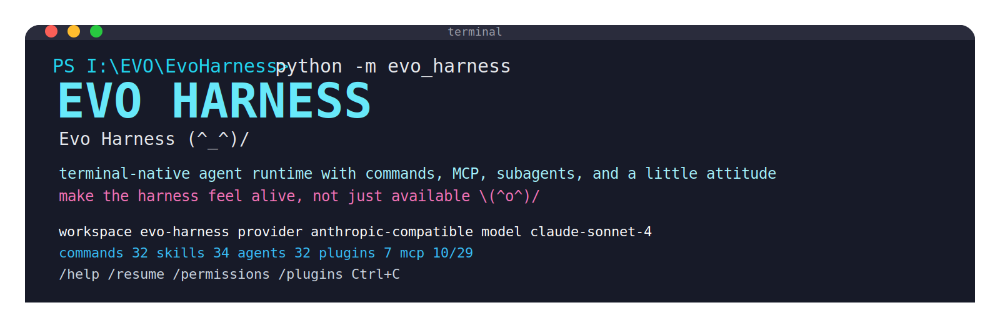
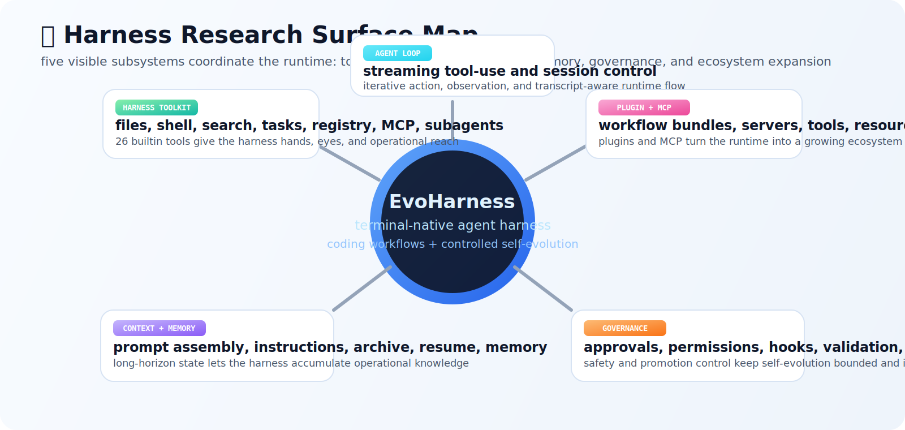

<p align="center">
  &nbsp;&nbsp;&nbsp;&nbsp;
  
</p>

<p align="center">
  
</p>

<p align="center">
  <a href="./README.md">English</a> | <strong>简体中文</strong>
</p>

<p align="center">
  <strong>Terminal-Native Agent Harness</strong>
</p>

<p align="center">
  Coding workflows | plugins | MCP | approvals | controlled self-evolution \(^o^)/
</p>

<p align="center">
  make the harness feel alive, sharp, and research-grade  (^_^)/ 
</p>

<p align="center">
  <a href="#-快速开始"></a>
  <a href="#-关键-harness-能力"></a>
  <a href="#-可控自进化"></a>
  <a href="#-harness-架构"></a>
</p>

<p align="center">
  
  
  
  
  
  
  
</p>

EvoHarness 的核心不是泛化的 “agent UI”，而是 **harness research**：

- 终端原生 coding agent 应该如何暴露 tools、workflow surfaces 与 governance
- archived runtime evidence 如何驱动 **controlled** self-evolution
- markdown、plugins 与 MCP 如何成为真实的研究与工程表面

---

## ✨ 关键 Harness 能力

<div align="center">
  
</div>

EvoHarness 主要由五个可见表面组成：

- **Agent Loop**：迭代式 tool-use 与 session control
- **Harness Toolkit**：files、shell、search、task、registry、MCP、subagent 工具
- **Context & Memory**：prompt assembly、instructions、archive、resume
- **Governance**：approvals、permissions、hooks、promotion discipline
- **Ecosystem**：plugins、MCP、commands、skills、agents 作为一等运行时资产

---

## 🧠 可控自进化

<div align="center">
  
</div>

EvoHarness 对“自进化”的处理更偏 **bounded runtime pipeline**，而不是无边界自治循环。

主流程是：

1. archive 真实 sessions、tool histories 与 runtime traces
2. analyze failure modes、ecosystem gaps 与 coordination pressure
3. 在小范围 operator family 中做选择，例如 `stop`、`distill_memory`、`revise_command`、`revise_skill`、`grow_ecosystem`
4. 针对真实 workspace 生成 candidate patches
5. validate before promotion
6. promote、hold 或 rollback

它强调：

- failure modes 可观测
- operator choice 显式化
- candidate-first evolution
- promotion / rollback discipline
- workspace-native artifacts，而不是隐藏内部状态

---

## 🧩 Harness 架构

<div align="center">
  
</div>

运行时把这些部分连接起来：

- terminal interaction 与 slash-command control
- tool execution、approvals、tasks、session state
- `.claude/` 里的可见 workflow surfaces
- plugin 与 MCP ecosystem
- memory、analytics 与 evolution planning

这个项目的主要架构立场是：**harness 不是背景胶水，而是主要研究对象。**

---

## 🚀 快速开始

### 环境要求

- Python 3.11+
- Node.js 18+（如果你要用 React/Ink terminal frontend）

### 最快启动方式

```bash
git clone https://github.com/HITSZ-DS/EvoHarness.git
cd EvoHarness
python -m evo_harness
```

如果本机有 `npm`，首次 TUI 启动时前端依赖会自动安装 `(^_^)/`

### 可选安装命令别名

如果你想直接使用更短的命令：

```bash
python -m pip install -e .
evoh
```

### 建议先跑的命令

```bash
evoh doctor --workspace .
evoh tools-list --workspace .
evoh commands-list --workspace .
evoh agents-list --workspace .
evoh mcp-list --workspace . --kind all
```

### 会话内常用入口

```text
/help
/permissions
/resume
/plugins
/plugins marketplaces
/docs-refresh onboarding flow
/workflow-blueprint provider debugging
```

---

## 🕸️ Plugin 与 MCP 生态

Bundled plugins:

- `safe-inspector`
- `evolution-studio`
- `web-research`
- `workspace-ops`
- `delivery-lab`
- `docs-foundry`
- `session-lab`

Bundled local MCP surfaces 覆盖：

- docs search 与 repair
- workspace surface inspection
- release-readiness review
- session 与 approval forensics
- public-web research
- plugin 与 workflow design

当前 runtime surface：

- **26 builtin tools**
- **32 commands**
- **34 skills**
- **32 agents**
- **7 plugins**
- **10 MCP servers**
- **29 MCP tools / 27 MCP resources / 10 MCP prompts**

---

## 📚 文档

- [Architecture](./docs/architecture.md)
- [Feature Matrix (zh-CN)](./docs/feature-matrix.zh-CN.md)
- [Project Positioning (zh-CN)](./docs/project-positioning.zh-CN.md)
- [Roadmap (zh-CN)](./docs/roadmap.zh-CN.md)
- [OpenHarness Reference](./docs/openharness-reference.md)

---

## 📝 引用

如果你希望将 EvoHarness 作为软件系统引用：

```bibtex
@software{evoharness2026,
  title  = {EvoHarness: A Terminal-Native Agent Harness with Controlled Self-Evolution},
  author = {EvoHarness Contributors},
  year   = {2026},
  url    = {https://github.com/HITSZ-DS/EvoHarness}
}
```

同时也提供了 [CITATION.cff](./CITATION.cff)。

---

## 📄 License

Apache-2.0，见 [LICENSE](./LICENSE)。
