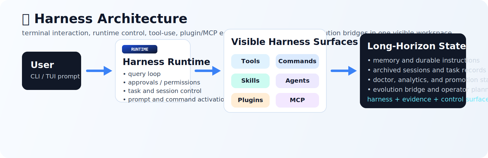

<table align="center">
  <tr>
    <td align="center" valign="middle" width="180">
      
    </td>
    <td align="left" valign="middle">
      
    </td>
  </tr>
</table>

<p align="center">
  
</p>

<p align="center">
  <a href="./README.md">English</a> | <strong>简体中文</strong>
</p>

<p align="center">
  <strong>EvoHarness 提供终端原生 Agent Harness 基础设施：</strong>
  tools、commands、skills、agents、plugins、MCP、memory、approvals，以及可控自进化。
</p>

<p align="center">
  <strong>一起完善项目：</strong>把开放、可见、可研究的 coding harness 打磨成真正可演进的工程表面。
</p>

<p align="center">
  <a href="#quick-start"></a>
  <a href="#harness-architecture"></a>
  <a href="#controlled-self-evolution"></a>
  <a href="#plugin-mcp-ecosystem"></a>
  <a href="#documentation"></a>
  <a href="./LICENSE"></a>
</p>

<p align="center">
  
  
  
  
  
  
  
  
  
</p>

<a id="controlled-self-evolution"></a>
## 🧠✨ 可控自进化

<div align="center">
  
</div>

<p align="center">
  <strong>🌌 证据、算子、候选补丁、验证关口与晋升路径 🩵</strong>
</p>

EvoHarness 把“自进化”看成对 harness 表面的**受控演化**，而不是放任 agent 自己随意变异。

真正的问题不是“模型能不能改自己一次”，而是：

- 🧾 **什么时候值得进化**：依据真实 sessions、traces、failures、approvals 与 workspace state
- 🎛️ **该选哪种算子**：`revise_command`、`revise_skill`、`distill_memory`、`grow_ecosystem`，或者 `stop`
- 🛑 **什么时候不该进化**：低价值变化要在真正改动前被拦住
- ✅ **变化如何进入系统**：candidate patch 必须先过 validation，再决定 promote、hold 或 rollback

所以这个闭环可以压缩成一句话：

**evidence -> operator choice -> candidate patch -> validation -> promote / hold / rollback**

一句话概括：EvoHarness 研究的不是“自由变异”，而是面向长期任务的**自进化控制**，作用对象是 commands、skills、agents、plugins、MCP、memory 与 policy surfaces。

<p align="center">
  
</p>

<p align="center">
  <strong>🐴 三阶段进化模式：普通马鞍 -> Harness 升级 -> 优雅进化 ✨🩵</strong>
</p>

---

<a id="harness-architecture"></a>
## 🧩🛠️ Harness 架构 \(^_^)/ 

<div align="center">
  
</div>

<p align="center">
  <strong>👀 可见表面 • 🧱 workspace-native 控制 • 🛰️ Plugin + MCP 生态 • 🧠 长程状态</strong>
</p>

EvoHarness 的核心架构判断是：**harness 本身就是一等工程表面**，不是藏在后面的 orchestration glue。

它的特点在于：

- 👀 **默认可见**：tools、commands、skills、agents、plugins、MCP 都能在 workspace 里被直接看到、检查和统计
- 🧱 **workspace-native**：markdown、registries、settings、memory、policy 都以真实项目资产存在
- 🧠 **面向长程运行**：approvals、archived sessions、analytics、evolution planning 留在同一个 runtime
- 🧪 **天然适合研究**：harness 可观察、可计数、可进化，而不是躲在黑箱后面

核心表面一眼看：

- 🛠️ **26 tools**：files、shell、search、tasks、registry、MCP、subagents
- 📜 **32 commands**：工作流的直接入口
- 🧠 **34 skills**：按需加载的过程性指导
- 🤖 **32 agents**：有边界的 delegation
- 🔌 **7 plugins**：workspace-native 的生态扩展
- 🛰️ **10 MCP servers / 29 MCP tools**：外部 tools、resources 与 prompts

如果你想最快看懂这个项目，可以这样走：

- 🚀 先跑 `evoh doctor --workspace .`，看清楚当前 runtime surface
- 🧭 再跑 `evoh tools-list --workspace .`、`evoh commands-list --workspace .`、`evoh agents-list --workspace .`、`evoh mcp-list --workspace . --kind all`
- 📚 再读 [Architecture](./docs/architecture.md)、[Project Positioning](./docs/project-positioning.zh-CN.md)、[Feature Matrix](./docs/feature-matrix.zh-CN.md)
- 🧩 最后去看 [plugins](./plugins)、[.claude](./.claude)、[.evo-harness/mcp.json](./.evo-harness/mcp.json)，就能把它当成一个真实 harness workspace 来理解

一句话概括：EvoHarness 不是“带点工具的 agent”，而是一个**可见、可编辑、可进化的 harness workspace** `(^_^)`

---

<a id="quick-start"></a>
## 🚀 快速开始

### 环境要求

- Python 3.11+
- Node.js 18+（如果需要 React/Ink terminal frontend）

### 最快启动方式

```bash
git clone https://github.com/HITSZ-DS/EvoHarness.git
cd EvoHarness
python -m evo_harness
```

如果本机存在 `npm`，首次 TUI 启动时会自动安装前端依赖 `(^_^)/`

### 可选命令别名

如果你想直接使用更短的命令：

```bash
python -m pip install -e .
evoh
```

### 建议先跑的命令

```bash
evoh doctor --workspace .
evoh tools-list --workspace .
evoh commands-list --workspace .
evoh agents-list --workspace .
evoh mcp-list --workspace . --kind all
```

### 会话内常用入口

```text
/help
/permissions
/resume
/plugins
/plugins marketplaces
/docs-refresh onboarding flow
/workflow-blueprint provider debugging
```

---

<a id="plugin-mcp-ecosystem"></a>
## 🕸️ Plugin 与 MCP 生态

Bundled plugins:

- `safe-inspector`
- `evolution-studio`
- `web-research`
- `workspace-ops`
- `delivery-lab`
- `docs-foundry`
- `session-lab`

Bundled MCP surfaces 覆盖：

- docs search 与 repair
- workspace surface inspection
- release-readiness review
- session 与 approval forensics
- public-web research
- plugin 与 workflow design

当前 runtime surface：

- **26 builtin tools**
- **32 commands**
- **34 skills**
- **32 agents**
- **7 plugins**
- **10 MCP servers**
- **29 MCP tools / 27 MCP resources / 10 MCP prompts**

---

<a id="documentation"></a>
## 📚 文档

- [Architecture](./docs/architecture.md)
- [Feature Matrix (zh-CN)](./docs/feature-matrix.zh-CN.md)
- [Project Positioning (zh-CN)](./docs/project-positioning.zh-CN.md)
- [Roadmap (zh-CN)](./docs/roadmap.zh-CN.md)
- [OpenHarness Reference](./docs/openharness-reference.md)

---

## 📝 引用

如果你希望将 EvoHarness 作为软件系统引用：

```bibtex
@software{evoharness2026,
  title  = {EvoHarness: A Terminal-Native Agent Harness with Controlled Self-Evolution},
  author = {EvoHarness Contributors},
  year   = {2026},
  url    = {https://github.com/HITSZ-DS/EvoHarness}
}
```

同时也提供了 [CITATION.cff](./CITATION.cff)。

---

## 📄 License

Apache-2.0，见 [LICENSE](./LICENSE)。
