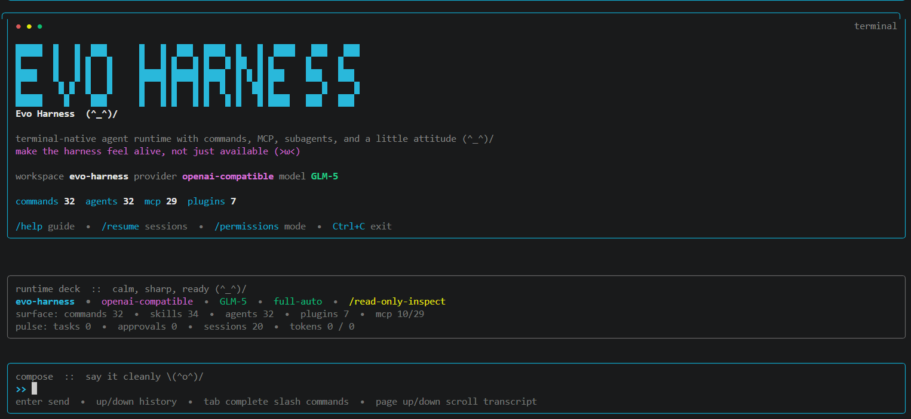
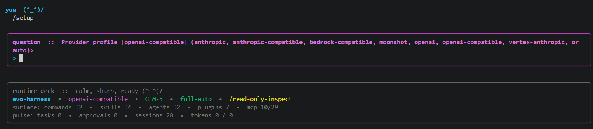

<table align="center">
  <tr>
    <td align="center" valign="middle" width="180">
      
    </td>
    <td align="left" valign="middle">
      
    </td>
  </tr>
</table>

<p align="center">
  
</p>

<p align="center">
  <a href="./README.md">English</a> | <strong>简体中文</strong>
</p>

<p align="center">
  <strong>EvoHarness 提供终端原生 Agent Harness 基础设施：</strong>
  tools、commands、skills、agents、plugins、MCP、memory、approvals，以及可控自进化。
</p>

<p align="center">
  <strong>一起完善项目：</strong>把开放、可见、可研究的 coding harness 打磨成真正可演进的工程表面。
</p>

<p align="center">
  <a href="#quick-start"></a>
  <a href="#harness-architecture"></a>
  <a href="#controlled-self-evolution"></a>
  <a href="#plugin-mcp-ecosystem"></a>
  <a href="#modes-commands"></a>
  <a href="./LICENSE"></a>
</p>

<p align="center">
  
  
  
  
  
  
  
  
  
</p>

<a id="controlled-self-evolution"></a>
## 🧠✨ 可控自进化

<div align="center">
  
</div>

<p align="center">
  <strong>🌌 证据、算子、候选补丁、验证关口与晋升路径 🩵</strong>
</p>

EvoHarness 把“自进化”看成对 harness 表面的**受控演化**，而不是放任 agent 自己随意变异。

真正的问题不是“模型能不能改自己一次”，而是：

- 🧾 **什么时候值得进化**：依据真实 sessions、traces、failures、approvals 与 workspace state
- 🎛️ **该选哪种算子**：`revise_command`、`revise_skill`、`distill_memory`、`grow_ecosystem`，或者 `stop`
- 🛑 **什么时候不该进化**：低价值变化要在真正改动前被拦住
- ✅ **变化如何进入系统**：candidate patch 必须先过 validation，再决定 promote、hold 或 rollback

所以这个闭环可以压缩成一句话：

**evidence -> operator choice -> candidate patch -> validation -> promote / hold / rollback**

一句话概括：EvoHarness 研究的不是“自由变异”，而是面向长期任务的**自进化控制**，作用对象是 commands、skills、agents、plugins、MCP、memory 与 policy surfaces。

<p align="center">
  
</p>

<p align="center">
  <strong>🐴 三阶段进化模式：普通马鞍 -> Harness 升级 -> 优雅进化 ✨🩵</strong>
</p>

---

<a id="harness-architecture"></a>
## 🧩🛠️ Harness 架构 \(^_^)/ 

<div align="center">
  
</div>

<p align="center">
  <strong>🧩 一个 runtime core • 👀 一组可见 harness 表面 • 🧠 一层长程状态</strong>
</p>

EvoHarness 的核心架构判断是：**harness 本身就是一等工程表面**，不是藏在后面的 orchestration glue。

它的特点在于：

- 👀 **默认可见**：tools、commands、skills、agents、plugins、MCP 都能在 workspace 里被直接看到、检查和统计
- 🧱 **workspace-native**：markdown、registries、settings、memory、policy 都以真实项目资产存在
- 🧠 **面向长程运行**：approvals、archived sessions、analytics、evolution planning 留在同一个 runtime
- 🧪 **天然适合研究**：harness 可观察、可计数、可进化，而不是躲在黑箱后面

核心表面一眼看：

- 🛠️ **27 tools**：files、shell、search、tasks、registry、MCP、subagents
- 📜 **32 commands**：工作流的直接入口
- 🧠 **34 skills**：按需加载的过程性指导
- 🤖 **32 agents**：有边界的 delegation
- 🔌 **7 plugins**：workspace-native 的生态扩展
- 🛰️ **11 MCP servers / 29 MCP tools**：外部 tools、resources 与 prompts

<p align="center">
  
</p>

<p align="center">
  <strong>🦄 用小马带你看一眼：tools、commands、skills、agents、plugins、MCP 最后都会汇入 runtime core ✨</strong>
</p>

如果你想最快看懂这个项目，可以这样走：

- 🚀 先跑 `evoh doctor --workspace .`，看清楚当前 runtime surface
- 🧭 再跑 `evoh tools-list --workspace .`、`evoh commands-list --workspace .`、`evoh agents-list --workspace .`、`evoh mcp-list --workspace . --kind all`
- 🧠 进入会话后再用 `/help`、`/commands`、`/skills`、`/agents`、`/mcp` 去摸清现场
- 🧩 最后去看 [plugins](./plugins)、[.claude](./.claude)、[.evo-harness/mcp.json](./.evo-harness/mcp.json)，就能把它当成一个真实 harness workspace 来理解

一句话概括：EvoHarness 不是“带点工具的 agent”，而是一个**可见、可编辑、可进化的 harness workspace** `(^_^)`

---

<a id="quick-start"></a>
## 🚀 快速开始

### 🧰 你需要准备什么

| 项目 | 作用 |
| --- | --- |
| `Python 3.11+` | 运行核心 runtime、CLI、MCP helper，以及本地 harness surface |
| `Node.js 18+` | 可选，仅在你想使用 React/Ink 前端时需要 |

即使没有 Node，EvoHarness 也能直接进入文本会话 `(^_^)/`

### 1. 🔍 安装并先做一次检查

```bash
git clone https://github.com/HITSZ-DS/EvoHarness.git
cd EvoHarness
python -m pip install -e .
evoh doctor --workspace .
```

只要 `doctor` 报告健康，基本就可以开始使用了。

### 2. 🚀 启动会话

```bash
evoh --workspace .
```

如果本机存在 `npm`，EvoHarness 会优先尝试 React/Ink 前端。  
如果没有，它会自动回退到文本会话。

<p align="center">
  
</p>

<p align="center">
  <strong>✨ 第一眼就能看到 runtime deck、slash commands 和 live harness status</strong>
</p>

### 3. 🛠️ 在会话里用 `/setup` 配置 Provider

进入会话后，先输入：

```text
/setup
```

EvoHarness 会依次问你四件事：

- 🧩 `Provider profile`：你要接哪一类 API / gateway
- 🤖 `Model`：你实际想跑的模型名
- 🔑 `API key`：现在直接粘贴，或者如果你已经放在别处就先留空
- 🌐 `Base URL`：如果你用的是自定义网关或非默认地址，这里必须明确填

<p align="center">
  
</p>

<p align="center">
  <strong>🛠️ `/setup` 是把 fresh session 变成真正可用会话的最快路径</strong>
</p>

### 🧭 Provider Profile 该怎么选？

| Profile | 更适合什么场景 | API 风格 | 常见 Key 环境变量 |
| --- | --- | --- | --- |
| `anthropic` | 原生 Claude 使用场景 | Anthropic Messages API | `ANTHROPIC_API_KEY` |
| `openai-compatible` | GLM、Qwen、DeepSeek、DashScope、OpenAI-like 网关 | `/v1/chat/completions` | 默认 `OPENAI_API_KEY` |
| `moonshot` | Kimi / Moonshot | OpenAI-compatible | `MOONSHOT_API_KEY` |
| `anthropic-compatible` | Claude 风格代理或内部网关 | Anthropic-compatible | `ANTHROPIC_API_KEY` |
| `auto` | 先快速跑通再说 | 根据 model + base URL 推断 | 跟随你的实际配置 |

推荐使用方式：

- 🔐 优先把 API key 放在环境变量里
- 🧭 用 `/setup` 负责 profile、model、base URL
- 🧱 如果你是要给一个新仓库初始化 EvoHarness，再用 `evoh init`

API key 这块可以直接这样理解：

- `anthropic` 和 `anthropic-compatible` 通常对应 `ANTHROPIC_API_KEY`
- `moonshot` 通常对应 `MOONSHOT_API_KEY`
- `openai-compatible` 默认对应 `OPENAI_API_KEY`，但你也可以在 `evoh init --api-key-env ...` 时改成自己的变量名

### 4. 🧱 把 EvoHarness 脚手架到你自己的仓库里

如果你不是只想跑本仓库，而是想把 EvoHarness 接到你自己的项目里：

```bash
evoh init --workspace . --provider-profile openai-compatible --model glm-5 --api-key-env ZHIPUAI_API_KEY --base-url https://open.bigmodel.cn/api/paas/v4/
```

这会生成 `CLAUDE.md`、`.evo-harness/settings.json`、起步版 `.claude/` 资产，以及本地 MCP registry。

后续建议马上跑：

```bash
evoh provider-detect --workspace .
evoh provider-template --profile openai-compatible --model glm-5
evoh doctor --workspace .
```

### 🧪 建议先跑的命令

```bash
evoh doctor --workspace .
evoh tools-list --workspace .
evoh commands-list --workspace .
evoh agents-list --workspace .
evoh mcp-list --workspace . --kind all
evoh provider-detect --workspace .
```

### 💬 会话内建议先记住这些命令

```text
/help
/setup
/login
/doctor
/plugins
/resume
/permissions
/exit
```

---

<a id="plugin-mcp-ecosystem"></a>
## 🕸️🔌 Plugin 与 MCP 生态 \(^o^)/

<p align="center">
  <strong>🔧 可安装 workflow bundle • 🛰️ MCP-native utilities • 🧩 一个保持可见的 workspace 生态</strong>
</p>

在 EvoHarness 里，plugins 和 MCP 不是附属挂件，而是产品表面的一部分。

可以直接这样理解：

- 🔌 plugin 会把 commands、skills、agents、MCP surface 围绕一个工作流主题打包起来
- 🛰️ MCP bundle 会把 docs、sessions、quality、workspace mapping 这些能力外化成 tools / resources / prompts
- 🧱 一切都保持 workspace-native，所以用户可以直接看见生态，而不是靠猜

### ✨ 内置 Plugin 家族

| Plugin | 关注点 | 它带来了什么 |
| --- | --- | --- |
| `safe-inspector` | 安全只读检查 | 谨慎检查 command、skill 和 reviewer agent |
| `evolution-studio` | trace triage + ecosystem growth | 进化命令、规划 skills、进化导向 agents |
| `web-research` | 公网研究 | research command、web skill、scout agent、搜索/抓取 MCP |
| `workspace-ops` | workspace mapping + registry hygiene | topology commands、packaging skills、workspace-intel MCP |
| `delivery-lab` | release readiness + regression review | ship-readiness workflows 与 quality-gate MCP |
| `docs-foundry` | docs repair + onboarding polish | README/docs workflows 与 docs-gap MCP |
| `session-lab` | sessions + approvals + tasks | task-board / forensics workflows 与 session-lab MCP |

### 🛰️ 核心 MCP 表面

| MCP Surface | 暴露了什么 | 最适合哪里 |
| --- | --- | --- |
| `workspace-docs` / `docs-gap` | 文档搜索、摘录、repair prompts | onboarding、README 漂移、docs lookup |
| `workspace-intel` | workspace snapshot + surface search | 看懂当前 live harness layout |
| `quality-gate` | doctor report、promotions、session summary | release readiness 与 regression review |
| `session-lab` | recent sessions、approvals、task board | 长程 workflow forensics |
| `web-research:web-research` | `search_web` + `fetch_page` | 不离开 harness 的公网研究 |

### 📡 当前生态表面

| 表面 | 数量 | 为什么重要 |
| --- | --- | --- |
| builtin tools | **26** | 文件、shell、registry、web、task、runtime 的直接动作 |
| commands | **32** | 可复用 workflow 入口 |
| skills | **34** | 按需加载的过程性指导 |
| agents | **32** | 有边界的 delegation 与 side work |
| plugins | **7** | 可安装的 workflow family |
| MCP servers | **10** | 本地 service bundle，负责 tools / resources / prompts |
| MCP tools / resources / prompts | **29 / 27 / 10** | 可复用、可外化的知识和动作 |

### 🧭 怎么快速摸清这个生态

在会话里：

```text
/plugins
/plugins marketplaces
/mcp
/commands
/agents
/skills
```

在 CLI 里：

```bash
evoh plugins-list --workspace .
evoh marketplaces-list --workspace .
evoh marketplace-plugins --workspace .
evoh mcp-list --workspace . --kind all
```

---

<a id="modes-commands"></a>
## 🎛️🧭 模式与命令 (•‿•)

<p align="center">
  <strong>🧠 provider + model • 🔐 permission mode • 🧩 active workflow command • 📡 live surface counts</strong>
</p>

进入会话后，EvoHarness 会把运行状态直接放在 runtime deck 里，而不是藏起来。

你最值得先看懂的是这几项：

| Runtime 字段 | 它表示什么 |
| --- | --- |
| 🧠 `provider` + `model` | 当前连接的是哪类后端、正在跑哪个模型 |
| 🔐 `mode` | 当前 permission mode |
| 🧩 `/<workspace-command>` | 当前激活的 markdown workflow，比如 `/read-only-inspect` |
| 📡 `surface` | commands、skills、agents、plugins、MCP 的实时数量 |
| 💓 `pulse` | tasks、approvals、sessions、tokens 等运行脉搏 |

权限模式其实很简单：

| 模式 | 行为 | 更适合什么 |
| --- | --- | --- |
| `default` | 读操作直接跑，改动类操作需要审批 | 日常正常开发 |
| `plan` | 阻止 mutating tools | 先检查、梳理、做规划 |
| `full-auto` | 只要不超出 sandbox 边界，就自动执行 | 已经信任环境时的高速迭代 |

命令层也很清楚：

| 表面 | 它负责什么 |
| --- | --- |
| `/help`、`/setup`、`/doctor`、`/permissions`、`/resume`、`/plugins`、`/mcp` | 会话级 slash commands |
| `/<workspace-command>` | 激活 `.claude/commands/` 里的 markdown workflow |
| `skills` | 按需加载的流程指南 |
| `agents` | 有边界的 delegation |
| `plugins` | 把 commands、skills、agents、MCP surface 打包在一起 |

建议第一次进会话先试这些：

```text
/help
/doctor
/commands
/skills
/agents
/mcp
/permissions
/read-only-inspect auth flow
```

如果你想先在 CLI 里看清楚这些表面，再进入聊天：

```bash
evoh commands-list --workspace .
evoh agents-list --workspace .
evoh tools-list --workspace .
evoh mcp-list --workspace . --kind all
```

---

## 📄 License

Apache-2.0，见 [LICENSE](./LICENSE)。


## 🙇‍ 特别感谢
[Linux.do](https://linux.do/)
